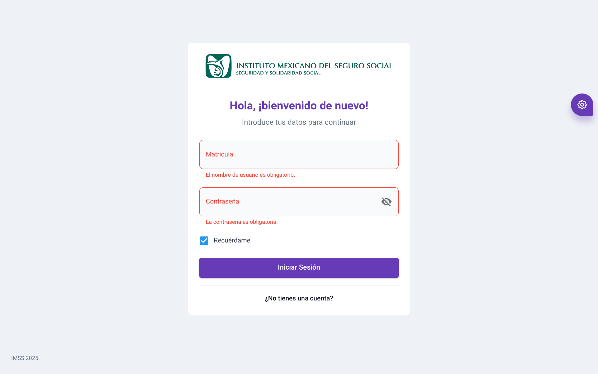
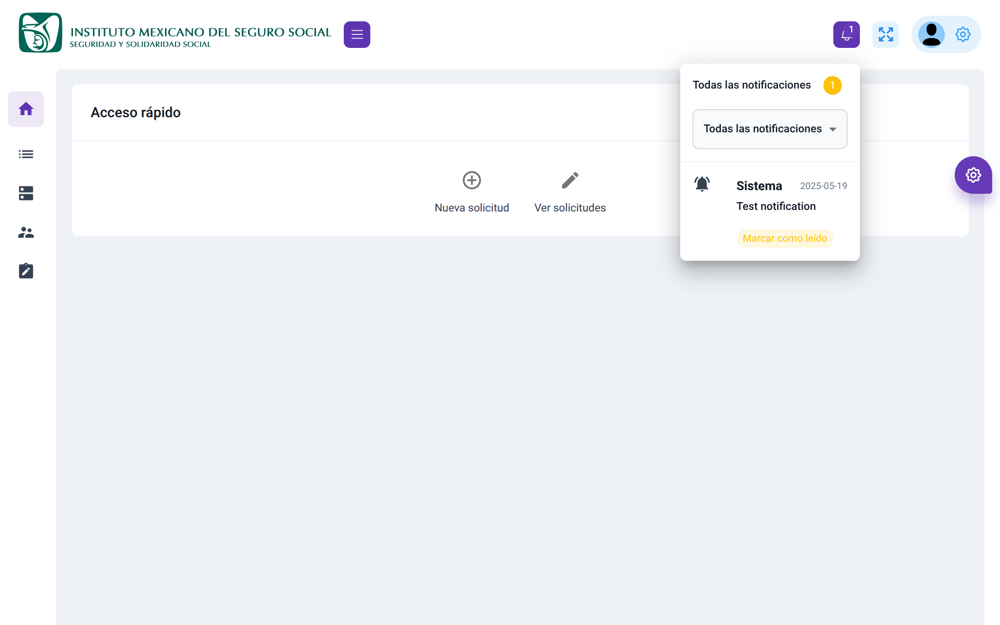
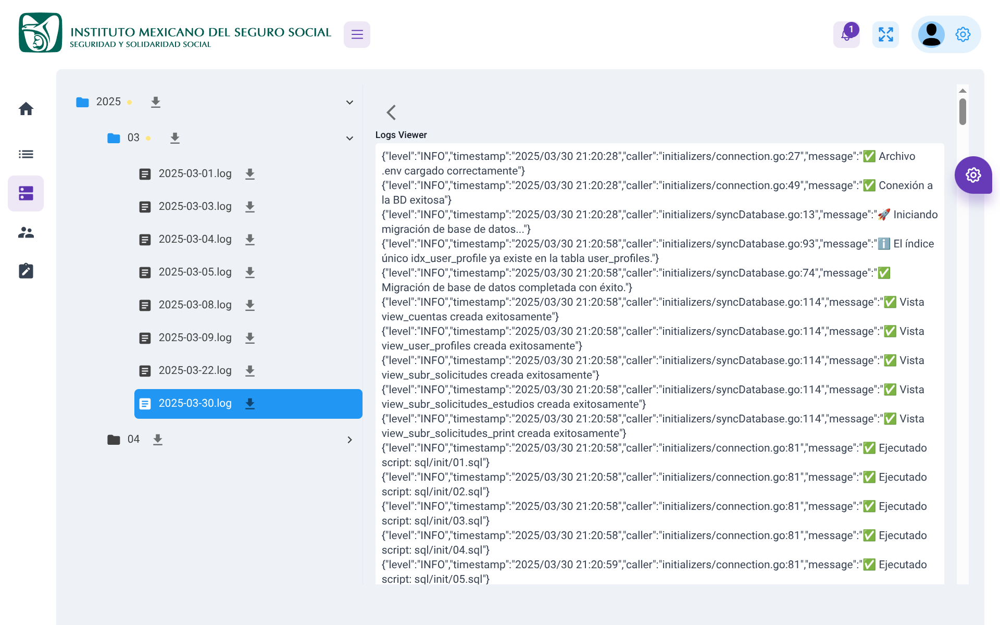

# 🚑 LivePreview — Modular Monitoring & Control System

**LivePreview** is a responsive, secure, and modular dashboard platform designed to monitor and manage service operations — originally created to support IMSS subrogated services. This public version showcases the architecture and capabilities of the system, serving as a flexible base for custom enterprise applications.

## 📸 Screenshots

> *(Replace these with actual screenshots located in `/public/screenshots/`)*

- 🔐 Login & Authentication  
- 🧩 Role-based access control  
- 📊 Real-time system monitoring  
- 📄 Log viewer  
- 📱 Mobile view (responsive layout)





## 🚀 Key Features

### 🔐 JWT Authentication
- Stateless authentication using **JSON Web Tokens**.
- Secure login and token-based access verification.

### 🧩 Role-Based Modular Permissions
- Inspired by Linux-style profiles and groups.
- Assign CRUD access dynamically based on user roles.
- Users can be deactivated by revoking all permissions.
- Designed to manage sensitive workflows with fine control.

### 🖥️ Real-Time Resource Monitoring
- Live preview of CPU, memory, and disk usage.
- Frontend polls backend metrics and updates without full reloads.

### 📄 Integrated Log Viewer
- View backend logs directly from the dashboard.
- Real-time stream with auto-scroll, filter, and search features.

### 📱 Responsive UI
- Designed for mobile and desktop.
- Easily accessible across all devices.

### 🔔 Notification System *(Planned)*
- Future versions will include contextual, role-aware notifications.
- Alerts for access issues, background jobs, and system events.

## 🧪 Tech Stack

| Layer        | Technology                     |
| ------------ | ------------------------------ |
| Frontend     | React, Tailwind CSS            |
| Backend      | Go (Golang)                    |
| Data Layer   | Redis                          |
| Auth         | JWT                            |
| Environment  | Docker + Linux                 |
| Infrastructure | Modular by design, portable  |

## 💼 Business Application & Context

LivePreview was initially developed to manage and audit subrogated service operations for the **Mexican Social Security Institute (IMSS)**. It replaced manual and Excel-based tracking systems, reducing errors and improving data flow visibility.

Today, it serves as a **scalable foundation** for tailored enterprise systems. For example, **ArenasCRM** was built from the same backend, with a new frontend tailored for mobile-first use cases.

### 🔍 Why LivePreview?

- Built to **adapt quickly** to new industries or institutions.
- Focuses on **speed and clarity** for users, minimizing errors via UI/UX decisions based on the "Don't make me think" principle.
- Enables businesses to **review and control operations remotely** and securely, without needing on-site access.
- Outperforms generic tools (e.g., spreadsheets or shared docs) by offering structured permissions and scalable architecture.

## 📦 Project Structure

```bash
livepreview/
├── src/
│   ├── auth/             # JWT handling and route protection
│   ├── components/       # UI Components (buttons, panels, cards)
│   ├── services/         # API clients and system resources
│   ├── screens/          # Main UI screens (Dashboard, Login, Logs)
│   └── utils/            # Helpers (roles matrix, validators, etc.)
├── backend/              # Go-based service logic (abstracted)
├── docker/               # Docker setup and scripts
├── public/screenshots/   # Images used in this README
├── README.md
```

## ⚙️ Getting Started

- Clone the repository
```
git clone https://github.com/gamequic/livepreview.git
cd livepreview
```

- Start containers (backend, frontend, redis, etc.)
```]
docker-compose up --build
```

- Or run frontend locally
```
cd frontend
npm install
npm run dev
```
# 📬 Contact
Want to collaborate or learn more?

[GitHub @gamequic](https://github.com/gamequic)

[Portfolio](https://calleros.dev)

## 🛑 Disclaimer
This is a non-sensitive version of a real enterprise system. Code and architecture are representative, but no institutional or private data is exposed. Designed for public showcasing and adaptation.

# 📄 License
This project is released under the **MIT** License.
